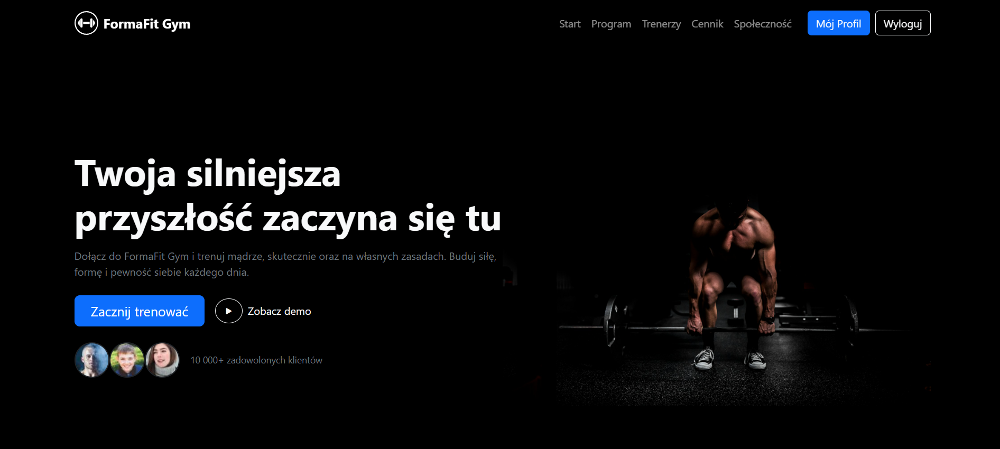
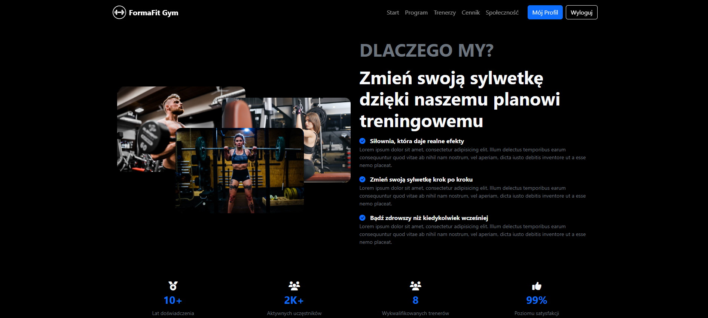
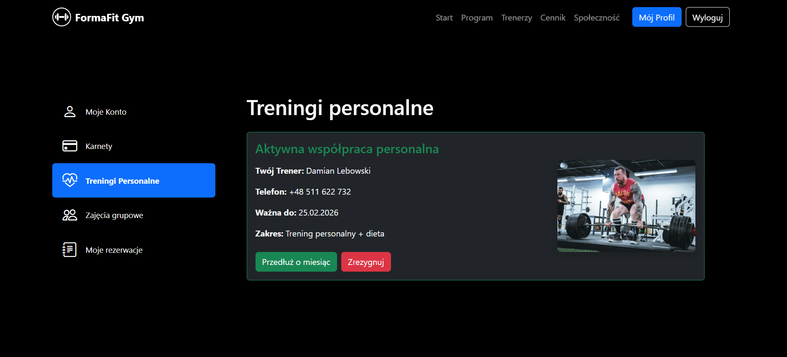
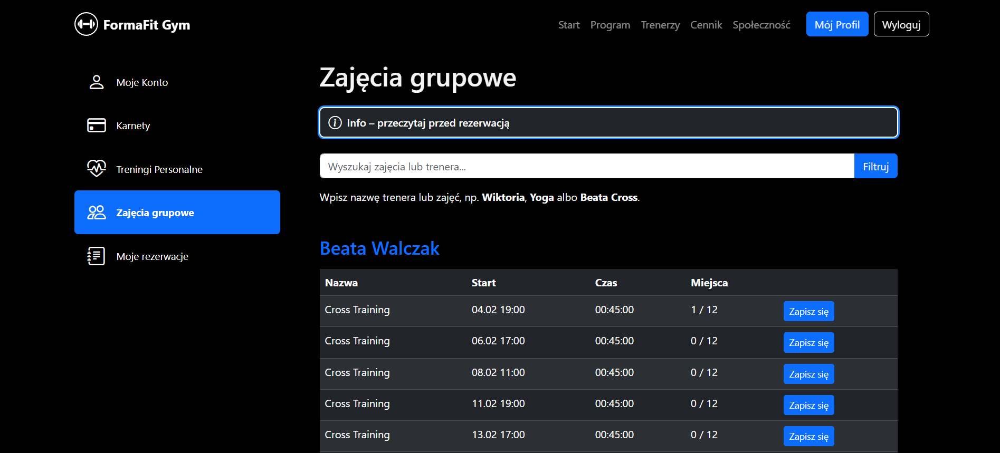

# FormaFit Gym - Gym Management System

_Full-stack web application built with ASP.NET Core MVC and Bootstrap._

> **Design inspiration:** Project’s UI is inspired by a Figma Community design by **Moch. Rizki Eko Waluyo**  
> https://www.figma.com/community/file/1268413829309445731  
> All visual credit goes to the original creator.

_FormaFit Gym is a learning and portfolio project simulating a landing page and a real gym management system on the user side, focused on UX, clean architecture, and design patterns._

*The application allows users to manage gym activities such as class bookings, memberships, and personal training cooperation.*

## Key Features

**User**
- Registration & login (ASP.NET Identity)
- Profile data management
- View and book group classes
- Cancel class bookings
- Manage gym passes
- Simulation of the newsletter subscription on the home page
- Start cooperation with a personal trainer

**Group Classes**
- Class schedule with trainers
- Slot limits & availability
- Booking system
- User-friendly class filtering
- Manage reservations

**Personal Trainers**
- Choose a personal trainer
- Select cooperation type: with diet or training only
- One active cooperation per user
- Cancel cooperation

## Tech stack

- ASP.NET Core MVC
- Entity Framework Core
- ASP .NET Identity
- SQLite
- Bootstrap 5
- Razor Views
- Dependency Injection
- Design patterns (Factory, Abstract Factory, Mediator, Singleton etc.)

## Roadmap

- Bootstrap created responsive UI
- Attractive professional landing page
- Authentication 
- Profile dashboard with sidebar navigation
- Classes booking
- Membership passes
- Filters / search for classes (Interpreter pattern)
- Notifications (Factory Method)
- UI polishing

## Why this project?

**This project is developed as part of the Advanced Programming course at a higher education institution.**

**Also, building this projects makes sense for me in a way to:**
- learn ASP.NET Core full-stack development
- understand clean architecture and patterns
- build a real-world app for portfolio

## How to Run the Project Locally

This project is an ASP.NET Core MVC application and must be run locally.

**Prerequisites**
- Windows OS
- .NET SDK 8.0 or newer (SDK 10.x is fully compatible with net8.0 projects)
- Visual Studio 2022 (recommended) or any IDE supporting .NET
- Entity Framework Core CLI tools

__To verify installed .NET version:__
> dotnet --version

__1. Clone the repository and run the project__
> git clone https://github.com/ep1cvoice/gym-manager-dotnet   
> cd gym-manager-dotnet  
> dotnet restore  
> dotnet ef database update  
> dotnet run  

Alternatively, open the project in Visual Studio and press Run.

**The application will be available at:**
> http://localhost:5254

__2. Create User Account__

- The project uses ASP.NET Identity.
- Open the application in a browser
- Go to Register
- Create a new account
- Log in and start using the system
- No default or seeded users are provided.

__3. Have fun!__
- Explore the UI of the landing page
- Try to register and log in
- Try to buy a pass
- Sign up for the newsletter on the home page
- Sign in for classes training
- Manage your reservations in profile
- Start a collaboration with a personal trainer (choose with or without diet!)
- Any feedback and critics are apreciated, please, share them if you'd like to. Thanks!

